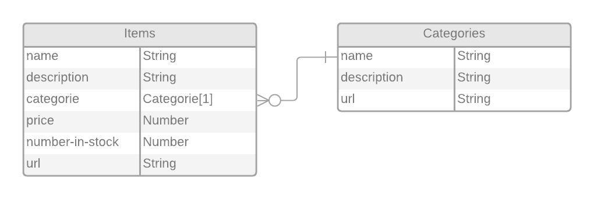

# PROJECT: Inventory App by express.js

This project is an inventory app that have categories and items, so when the user goes to the home-page they can choose a category to view, and then get a list of every item in that category.

## Live Demo

[Live Demo Link]() .

## Built With
- Node.
- Express.js.
- Npm.
- Html.
- CSS.
- Bootstarp.
- PUG.

## Features:

It includes all of the CRUD methods for both items and categories, so anybody that’s visiting the site can Create, Read, Update or Delete any Item or Category.

### Prerequisites

1. Git.
2. Code editor.
3. browser.
4. Node.

## How to run the program

### On your local machine:

1. Open your terminal.

2. Enter `git clone https://github.com/othman-19/Inventory-app-expressjs`.

3. Navigate to the cloned repository.

4. In the terminal cd into Inventory-app-expressjs.

5. Run `npm install` in your terminal.

6. Run `npm run serverstart` or `DEBUG=inventory-app-expressjs:* npm run devstart` in your terminal.

7. In your browser try this url: `http://localhost:3000/`.

8. Navigate to other pages by clicking on links.

9. Start adding new items and categories, update them, create or delete others.

## Author(s)
[Othmane Namani](https://github.com/othman-19/).  
[Email: othmanenaamani@gmail.com](mailto:othmanenaamani@gmail.com).  
[Portfolio](https://othman-19.github.io/my_portfolio/).  
[LinkedIn](https://www.linkedin.com/in/othman-namani/).  
[twitter](https://twitter.com/ONaamani).  
[DEV Community](https://dev.to/othman).  
[Angel List](https://angel.co/othmane-namani).  

## 🤝 Contributing

Contributions, issues and feature requests are welcome!

Feel free to check the [issues page](issues/).

## Show your support

Give a ⭐️ if you like this project!

